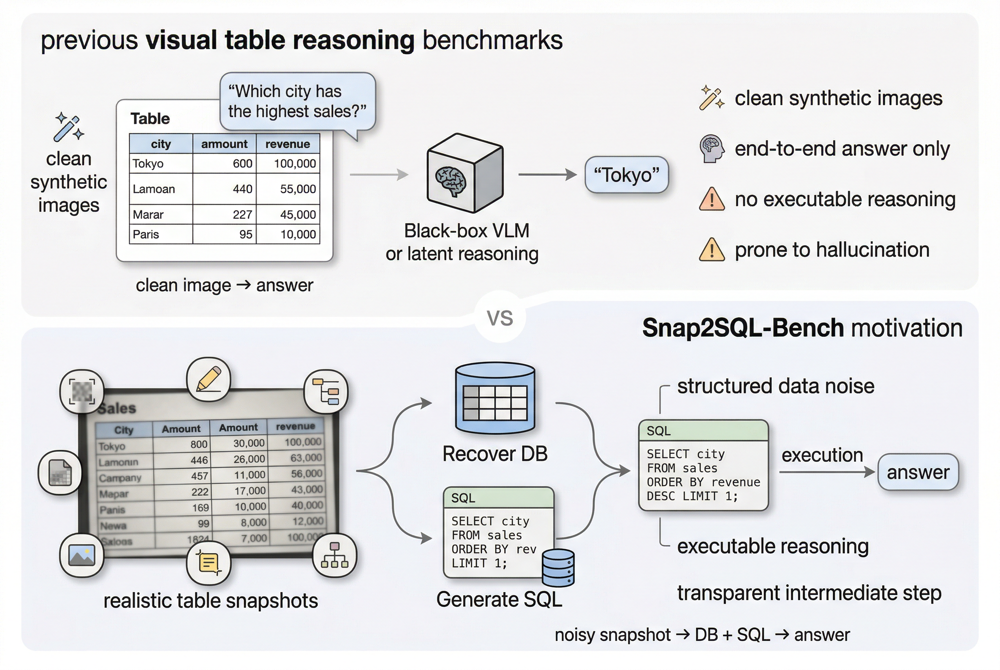
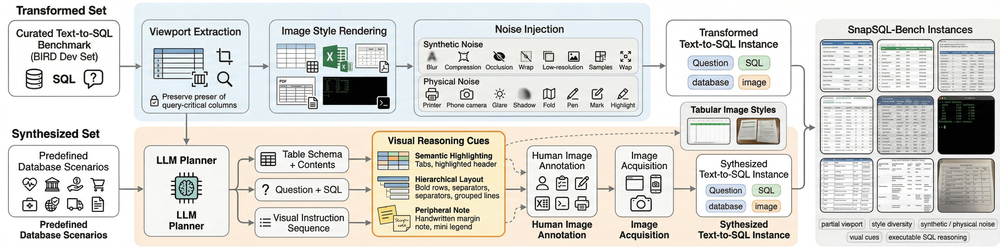
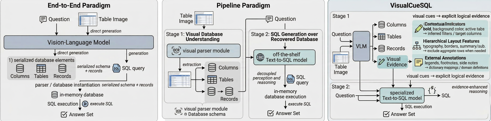

# SnapSQL-Bench: A Benchmark for Visual Text-to-SQL

[](LICENSE)
[](https://www.python.org/)
[](https://huggingface.co/datasets/yshihao/SnapSQLBench)

This is the official repository for **SnapSQL-Bench**, a comprehensive benchmark designed to evaluate visual Text-to-SQL systems. 

The full dataset is publicly available and hosted on  [Hugging Face](https://huggingface.co/datasets/yshihao/SnapSQLBench)🤗.

> 📌 **Paper Appendix:** For an in-depth look at dataset construction details and comprehensive visual examples, please refer to the [**Appendix.pdf**](./Snap2SQL-Appendix.pdf) included in this repository.

## 📖 Abstract & Introduction



In today's data-driven world, a significant portion of structured tabular data is trapped in non-interactive visual formats like screenshots, PDFs, and photographs. This **"vision isolation"** renders the data inaccessible for automated analysis and ad-hoc querying. While existing visual table reasoning benchmarks (like TableQA) attempt to solve this, they lack the deterministic rigor of Text-to-SQL and often fail to account for the visual noise ubiquitous in real-world scenarios.

**SnapSQL-Bench** bridges these gaps by systematically evaluating both **robustness to realistic table-image corruption** and the **ability to reason over task-relevant visual cues**. We establish three visual Text-to-SQL paradigms and propose **VisualCueSQL**, a novel method that translates visual cues into explicit logical evidence for SQL synthesis, significantly improving executable SQL generation.

## 🗂️ Benchmark Construction

  

SnapSQL-Bench comprises two complementary components, yielding a total of 860 complex queries across 1,369 images:

1. **Transformed Set ($\mathcal{X}_\alpha$):** Adapted from expert-curated Text-to-SQL benchmarks (e.g., BIRD). We introduce real-world visual noise (downsampling, blurring, physical print-and-photograph artifacts, shadows) while faithfully preserving the original complex SQL reasoning patterns and simulating constrained viewports.

2. **Synthesized Set ($\mathcal{X}_\beta$):** Built from scratch via LLM planning and human annotation to explicitly test whether models can exploit specific **Visual Reasoning Cues**:
   * *Semantic Highlighting:* Colored backgrounds or bold headers indicating filtering conditions.
   * *Hierarchical Layout:* Structural cues hinting at grouping or aggregation.
   * *Peripheral Notes:* Handwritten margin notes or legends encoding constraints.
   


## 🚀 Three Evaluation Paradigms
  

Our codebase supports three distinct visual Text-to-SQL paradigms:

* **End-to-End:** A single Vision-Language Model (VLM) directly generates the database schema, content, and the final SQL query from the image.
* **Pipeline:** Separates visual table parsing (extracting schema and content via VLM) from SQL generation (using an off-the-shelf text-to-SQL agent).
* **VisualCueSQL (Ours):** Explicitly extracts visual observations (highlights, layouts) from tabular images, translates them into plain-text evidence, and incorporates this evidence to guide downstream SQL reasoning.

## 📊 Experimental Results

Extensive experiments on SnapSQL-Bench reveal that current VLMs struggle with vision isolation, while our **VisualCueSQL** consistently yields sizable improvements.

### Main Results (Schema, Content, and Execution Accuracy)
*Note: Ovr = Overall, E = Easy, M = Medium, H = Hard.*

| Paradigm | VLM Backbone | Text-to-SQL Model | Sch-E | Sch-M | Sch-H | **Sch-Ovr** | Con-E | Con-M | Con-H | **Con-Ovr** | Exec-E | Exec-M | Exec-H | **Exec-Ovr** |
|:---|:---|:---|:---:|:---:|:---:|:---:|:---:|:---:|:---:|:---:|:---:|:---:|:---:|:---:|
| **End2End** | GPT-5.2 | - | 97.1 | 96.8 | 87.4 | **93.8** | 87.5 | 83.9 | 68.1 | **79.8** | 56.1 | 45.4 | 42.5 | **48.0** |
| **End2End** | Qwen3-VL-PLUS | - | 96.2 | 92.3 | 91.2 | 93.2 | 82.4 | 74.5 | 68.1 | 75.0 | 56.5 | 44.2 | 39.9 | 46.9 |
| **End2End** | Gemini-2.5-flash | - | 92.2 | 77.1 | 90.6 | 86.6 | 74.5 | 58.5 | 63.3 | 65.4 | 46.0 | 29.7 | 30.7 | 35.5 |
| **End2End** | InternVL3-38B | - | 91.9 | 76.8 | 78.3 | 82.3 | 61.6 | 52.3 | 39.8 | 51.2 | 38.3 | 20.9 | 18.0 | 25.7 |
| **End2End** | Qwen2.5-VL-32B | - | 95.8 | 94.8 | 89.7 | 93.4 | 75.6 | 73.8 | 60.9 | 70.1 | 43.7 | 29.1 | 29.4 | 34.1 |
| --- | --- | --- | --- | --- | --- | --- | --- | --- | --- | --- | --- | --- | --- | --- |
| **Pipeline** | GPT-5.2 | CodeS | 97.9 | 95.8 | 89.1 | 94.2 | 89.6 | 83.5 | 68.6 | 80.6 | 48.7 | 26.2 | 20.2 | 31.7 |
| **Pipeline** | GPT-5.2 | Mac-SQL | 97.9 | 95.8 | 89.1 | 94.2 | 89.6 | 83.5 | 68.6 | 80.6 | 51.1 | 32.6 | 26.3 | 36.7 |
| **Pipeline** | GPT-5.2 | GEN-SQL | 97.9 | 95.8 | 89.1 | 94.2 | 89.6 | 83.5 | 68.6 | 80.6 | 47.0 | 23.3 | 21.1 | 30.5 |
| **Pipeline** | Qwen3-VL-PLUS | CodeS | 95.9 | 94.1 | 89.4 | 93.1 | 82.7 | 76.4 | 67.8 | 75.6 | 44.1 | 23.8 | 18.9 | 28.9 |
| **Pipeline** | Qwen3-VL-PLUS | Mac-SQL | 95.9 | 94.1 | 89.4 | 93.1 | 82.7 | 76.4 | 67.8 | 75.6 | 48.7 | 32.6 | 24.1 | 35.1 |
| **Pipeline** | Qwen3-VL-PLUS | GEN-SQL | 95.9 | 94.1 | 89.4 | 93.1 | 82.7 | 76.4 | 67.8 | 75.6 | 44.6 | 25.6 | 19.3 | 29.8 |
| --- | --- | --- | --- | --- | --- | --- | --- | --- | --- | --- | --- | --- | --- | --- |
| **VisCueSQL** | GPT-5.2 | CodeS | 97.5 | 94.1 | 88.3 | 93.3 | 88.8 | 80.6 | 67.6 | 79.0 | 60.7 | 45.4 | 40.8 | 49.0 |
| **VisCueSQL** | GPT-5.2 | Mac-SQL | 97.5 | 94.1 | 88.3 | 93.3 | 88.8 | 80.6 | 67.6 | 79.0 | 61.9 | **45.9** | **42.5** | **50.1** |
| **VisCueSQL** | GPT-5.2 | GEN-SQL | 97.5 | 94.1 | 88.3 | 93.3 | 88.8 | 80.6 | 67.6 | 79.0 | 62.0 | 43.6 | 39.1 | 48.2 |
| **VisCueSQL** | Qwen3-VL-PLUS | CodeS | 95.8 | 92.2 | 88.7 | 92.3 | 81.6 | 74.5 | 67.6 | 74.6 | 53.9 | 44.1 | 36.8 | 44.9 |
| **VisCueSQL** | Qwen3-VL-PLUS | Mac-SQL | 95.8 | 92.2 | 88.7 | 92.3 | 81.6 | 74.5 | 67.6 | 74.6 | 55.8 | **45.9** | 40.4 | 47.4 |
| **VisCueSQL** | Qwen3-VL-PLUS | GEN-SQL | 95.8 | 92.2 | 88.7 | 92.3 | 81.6 | 74.5 | 67.6 | 74.6 | 54.4 | 41.9 | 36.9 | 44.4 |

## 📁 Repository Structure

```
SnapSQL/
├── main_end2end.py        # Entry point for the End-to-End paradigm
├── main_pipeline.py       # Entry point for the Pipeline paradigm
├── main_visualcue.py      # Entry point for the VisualCueSQL paradigm
├── models/                # VLM and Text-to-SQL wrappers (GPT-5, Qwen, CodeS, etc.)
├── configs/               # YAML configuration files for Easy/Medium/Hard splits
│   ├── e2e/               
│   └── pipeline_and_visualcue/ 
├── utils/                 # Dataset loaders, Prompts, Evaluators, Database Builder
```

## 🛠️ Installation & Quick Start

```bash
git clone [https://github.com/yshihao-ai/SnapSQLBench.git](https://github.com/yshihao-ai/SnapSQLBench.git)
cd SnapSQL

# Create environment
conda create -n SnapSQL python=3.12
conda activate SnapSQL
pip install -r requirements.txt
```

**1. Run End-to-End Evaluation:**
```bash
python main_end2end.py --config configs/e2e/e2e_hard.yaml
```

**2. Run Pipeline Evaluation:**
```bash
python main_pipeline.py --config configs/pipeline_and_visualcue/middle/pipeline_middle_codes.yaml
```

**3. Run VisualCueSQL Evaluation:**
```bash
python main_visualcue.py --config configs/pipeline_and_visualcue/hard/pipeline_hard_macsql.yaml
```

